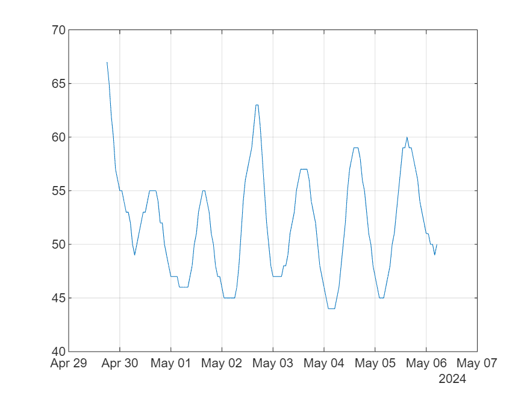

# Task 2

**Resources**

-  [https://www.weather.gov/documentation/services\-web\-api](https://www.weather.gov/documentation/services-web-api) 
-  [https://api.weather.gov/points/42.2813,\-71.355](https://api.weather.gov/points/42.2813,-71.355) 
-  [https://api.weather.gov/gridpoints/BOX/62,85/forecast/hourly](https://api.weather.gov/gridpoints/BOX/62,85/forecast/hourly) 
<a name="beginToc"></a>

## Table of Contents
[Build Timetable](#build-timetable)
 
[Plot data over time](#plot-data-over-time)
 
<a name="endToc"></a>

# **Get weather from web service**
```matlab
jason = webread("https://api.weather.gov/gridpoints/BOX/62,85/forecast/hourly");
% pol = jason.geometry.coordinates; geoscatter(pol(:,:,1),pol(:,:,2))
```

# Build Timetable
```matlab
T = struct2table(jason.properties.periods);
time = datetime(T.startTime,"InputFormat","uuuu-MM-dd'T'HH:mm:ssssZZZZZ","TimeZone","America/New_York");
temperature = T.temperature;
TT = timetable(time,temperature)
```
| |time|temperature|
|:--:|:--:|:--:|
|1|29-Apr-2024 18:00:00|67|
|2|29-Apr-2024 19:00:00|65|
|3|29-Apr-2024 20:00:00|62|
|4|29-Apr-2024 21:00:00|60|
|5|29-Apr-2024 22:00:00|57|
|6|29-Apr-2024 23:00:00|56|
|7|30-Apr-2024 00:00:00|55|
|8|30-Apr-2024 01:00:00|55|
|9|30-Apr-2024 02:00:00|54|
|10|30-Apr-2024 03:00:00|53|
|11|30-Apr-2024 04:00:00|53|
|12|30-Apr-2024 05:00:00|52|
|13|30-Apr-2024 06:00:00|50|
|14|30-Apr-2024 07:00:00|49|

# Plot data over time
```matlab
plot(TT.time,TT.temperature)
grid on
```



# **Export data**
```matlab
writetimetable(TT,'Data/natick.csv')
```

# **Create reports**
```matlab
export('Tasks/task2.mlx','Reports/task2.md');
export('Tasks/task2.mlx','Reports/task2.ipynb');
export('Tasks/task2.mlx','Reports/task2.docx');
export('Tasks/task2.mlx','Reports/task2.pdf');
export('Tasks/task2.mlx','Reports/task2.html');
```
